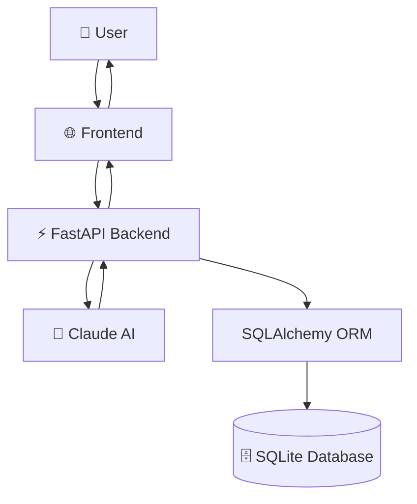
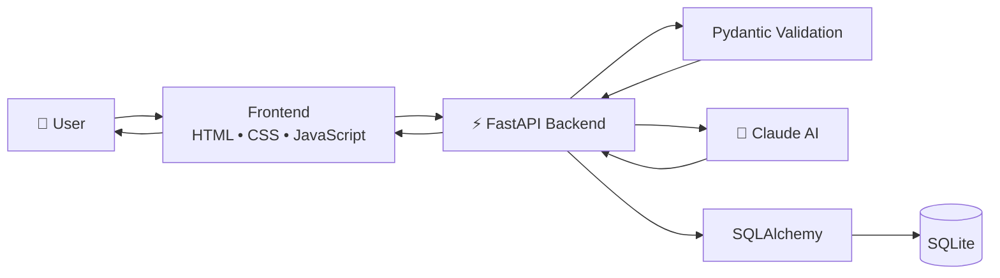
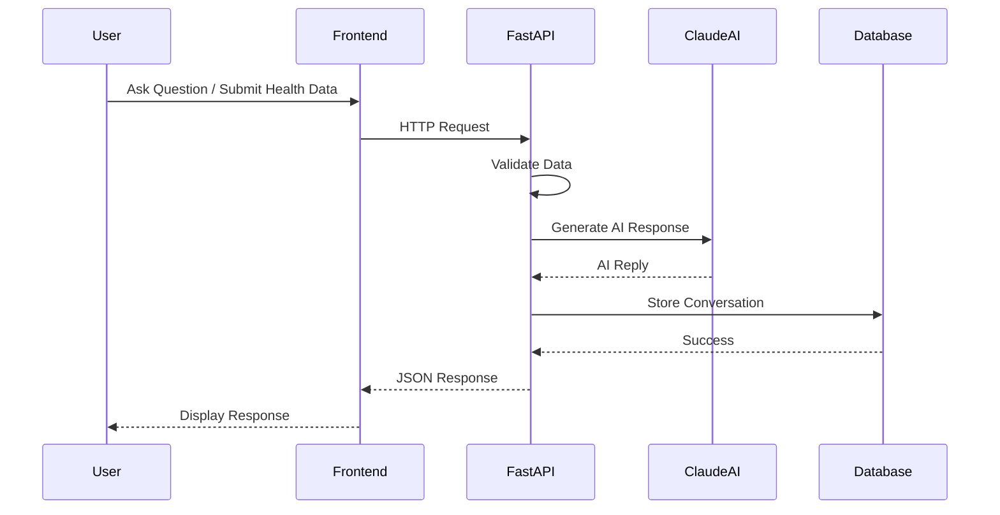
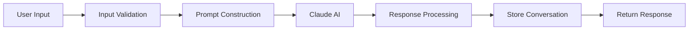
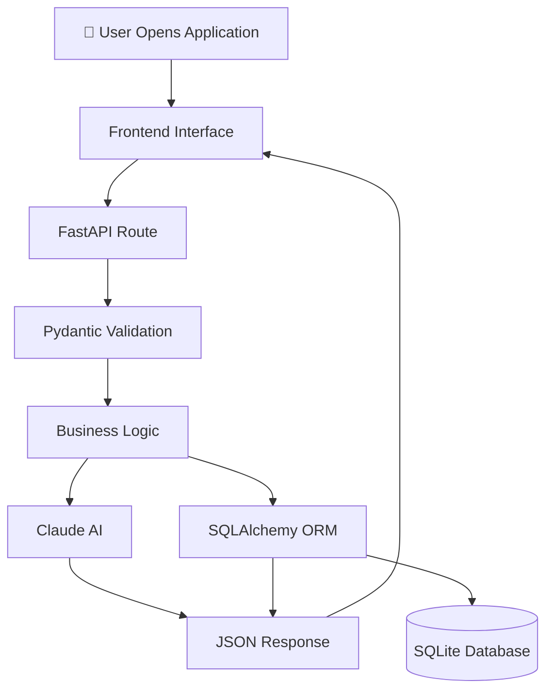
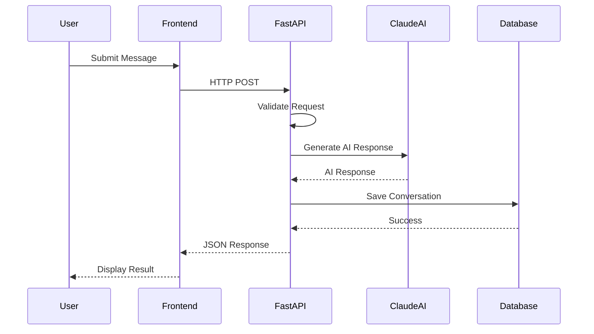

<div align="center">

# 🦷 Toothless AI

### Intelligent AI-Powered Personal Healthcare Assistant

*Transforming personal healthcare with Artificial Intelligence, FastAPI, and Claude AI.*

<br>

<p align="center">


</p>

<br>


</div>

---

# 🌟 Overview

**Toothless AI** is an intelligent AI-powered personal healthcare assistant designed to simplify daily health management through natural language conversations and structured health tracking.

Unlike traditional healthcare applications that focus on a single feature, Toothless AI combines conversational AI, symptom monitoring, medication management, mood tracking, health record organization, and wellness insights into one unified platform.

Powered by **Claude AI**, **FastAPI**, and **SQLAlchemy**, the application demonstrates how modern Large Language Models (LLMs) can be integrated into a scalable healthcare system while following clean software engineering principles.

---

# 🎯 Problem Statement

Managing personal healthcare often requires using multiple disconnected applications:

- 📒 Notes for symptoms
- 💊 Medication reminder apps
- 📅 Calendar reminders
- 📈 Health journals
- 🤖 AI chatbots
- 📂 Medical records

Switching between different applications makes health management fragmented and inefficient.

Toothless AI solves this problem by providing a centralized AI-driven healthcare platform where users can:

- Communicate naturally with an AI assistant
- Store personal medical records
- Track medications
- Monitor mood and wellness
- Maintain conversation history
- Organize health-related information in one place

---

# ✨ Key Features

<table>
<tr>

<td width="33%">

## 🤖 AI Assistant

- Claude AI Integration
- Context-aware responses
- Natural conversations
- Health guidance
- Conversation history

</td>

<td width="33%">

## ❤️ Health Tracking

- Daily Check-ins
- Symptom Logging
- Mood Tracking
- Wellness Monitoring
- Personal Health Timeline

</td>

<td width="33%">

## 💊 Medication

- Medication Records
- Dosage Tracking
- Medicine History
- Organized Health Data
- Future Reminder Support

</td>

</tr>
</table>

---

# 📸 Application Preview

> **Screenshots will be added here after deployment.**

| Dashboard | AI Chat | Health Records |
|-----------|----------|----------------|
|  |  |  |

| Medication | Mood Tracker | Analytics |
|------------|-------------|-----------|
|  |  |  |

---

# 🚀 Tech Stack

| Category | Technologies |
|-----------|--------------|
| **Programming Language** | Python |
| **Backend Framework** | FastAPI |
| **AI Model** | Claude AI (Anthropic) |
| **Database ORM** | SQLAlchemy |
| **Database** | SQLite |
| **Frontend** | HTML5, CSS3, JavaScript |
| **Validation** | Pydantic |
| **API** | RESTful APIs |

---

# 🏗 High-Level Architecture



---

# 📑 Table of Contents

- Project Overview
- Features
- Architecture
- Folder Structure
- Installation
- Usage
- API Documentation
- Database Design
- AI Workflow
- Screenshots
- Future Roadmap
- Contributing
- License
- Author

---

# 🏛️ System Architecture

Toothless AI follows a modular, layered architecture that separates the user interface, backend logic, AI engine, and database into independent components. This design improves maintainability, scalability, and makes it easier to add new features in the future.



---

# 🔄 Request Lifecycle

Every interaction inside Toothless AI follows a structured workflow to ensure data validation, AI processing, and secure storage.



---

# 📂 Project Structure

```text
AI_Bot_Toothless
│
├── 📁 frontend
│   ├── 📄 index.html
│   ├── 📄 style.css
│   └── 📄 app.js
│
├── 📄 main.py
├── 📄 toothless_ai.py
├── 📄 database.py
├── 📄 models.py
├── 📄 schemas.py
├── 📄 config.py
├── 📄 demo.py
│
├── 📄 requirements.txt
├── 📄 README.md
├── 📄 .gitignore
└── 📄 LICENSE
```

---

# 📂 Directory Overview

The project has been intentionally divided into multiple modules, each with a clearly defined responsibility. This keeps the codebase organized, easier to debug, and scalable for future development.

---

## 📁 frontend/

The `frontend` directory contains the complete client-side application that users interact with through the browser.

### 📄 index.html

Responsible for:

- Application layout
- Chat interface
- Health forms
- Dashboard components
- User interaction elements

---

### 📄 style.css

Handles:

- Responsive layout
- Typography
- Colors
- Cards
- Buttons
- Animations
- Mobile compatibility

---

### 📄 app.js

Acts as the bridge between the frontend and backend.

Responsibilities include:

- Sending API requests
- Receiving AI responses
- Updating the interface dynamically
- Rendering chat messages
- Handling user interactions

---

# 🧩 Backend Modules

The backend is built using **FastAPI** and follows a modular design.

Each Python module has a dedicated purpose.

---

## 📄 main.py

### Purpose

The application's main entry point.

This file starts the FastAPI server and exposes all REST API endpoints.

### Responsibilities

- Initialize FastAPI
- Register routes
- Handle incoming HTTP requests
- Validate request data
- Call AI services
- Connect to database
- Return JSON responses

---

## 📄 toothless_ai.py

### Purpose

Contains the complete AI layer of the application.

Instead of mixing AI logic with API endpoints, Toothless AI keeps every AI-related operation inside a dedicated module.

### Responsibilities

- Prompt engineering
- Claude AI communication
- Response formatting
- Conversation management
- AI error handling

---

## 📄 database.py

### Purpose

Centralized database connection manager.

Responsibilities:

- Create SQLAlchemy engine
- Initialize database
- Manage sessions
- Handle transactions
- Close connections safely

---

## 📄 models.py

Defines the application's database schema using SQLAlchemy ORM.

It maps Python objects directly to SQLite tables.

The ORM approach eliminates the need to write raw SQL queries for everyday operations.

---

## 📄 schemas.py

Contains every Pydantic model used for validating requests and formatting responses.

Benefits include:

- Automatic validation
- Type safety
- Better API documentation
- Cleaner error handling

---

## 📄 config.py

Stores all configuration values used throughout the application.

Examples include:

- Claude API configuration
- Database settings
- Environment variables
- Application constants

Keeping configuration isolated makes the project easier to maintain and deploy.

---

## 📄 demo.py

Provides a simple demonstration of the application's functionality without requiring the full frontend workflow.

Useful for:

- Development
- Debugging
- Testing
- Demonstrations

---

# ⚙️ Technology Choices

Every technology used in Toothless AI was selected for a specific reason.

| Technology | Why It Was Chosen |
|------------|-------------------|
| **FastAPI** | High-performance asynchronous API framework with automatic documentation |
| **Claude AI** | Natural language understanding and contextual healthcare conversations |
| **SQLAlchemy** | Robust ORM that simplifies database operations |
| **SQLite** | Lightweight relational database suitable for local development |
| **Pydantic** | Strong data validation and serialization |
| **HTML/CSS/JavaScript** | Lightweight frontend without unnecessary dependencies |

---

# 🧠 AI Processing Pipeline

The AI workflow follows a clean and modular pipeline.



---

# 🎯 Design Principles

The project follows several modern software engineering principles.

- ✅ Modular Architecture
- ✅ Separation of Concerns
- ✅ RESTful API Design
- ✅ Layered Application Structure
- ✅ Reusable Components
- ✅ Easy Maintenance
- ✅ Scalable Code Organization
- ✅ Clean Code Practices

These principles make Toothless AI easier to understand, test, maintain, and extend as the project evolves.

---

# 🚀 Getting Started

This guide will help you set up **Toothless AI** on your local machine for development and testing.

---

# 📋 Prerequisites

Before running the project, ensure you have the following installed:

| Requirement | Version |
|-------------|---------|
| Python | 3.10 or later |
| pip | Latest |
| Git | Latest |
| Claude API Key | Required |

Verify your Python version:

```bash
python --version
```

---

# 📥 Clone the Repository

```bash
git clone https://github.com/psyccho00/AI_Bot_Toothless.git
```

Move into the project directory:

```bash
cd AI_Bot_Toothless
```

---

# 📦 Install Dependencies

Install all required packages using:

```bash
pip install -r requirements.txt
```

---

# ⚙️ Configuration

Toothless AI requires a Claude API key to communicate with the AI model.

Depending on your implementation, configure the API key inside your configuration file or using environment variables.

Example:

```python
CLAUDE_API_KEY="YOUR_API_KEY"
```

> **Security Tip:** Never commit your personal API keys to GitHub.

---

# 🔑 Environment Variables (Recommended)

Create a `.env` file in the project root:

```env
CLAUDE_API_KEY=your_api_key_here
DATABASE_URL=sqlite:///toothless.db
```

Then load it using `python-dotenv` (if your project supports it).

---

# ▶️ Running the Application

Start the FastAPI server:

```bash
uvicorn main:app --reload
```

or

```bash
python main.py
```

After starting the server, open your browser:

```
http://127.0.0.1:8000
```

---

# 📚 Interactive API Documentation

FastAPI automatically generates interactive API documentation.

Swagger UI:

```
http://127.0.0.1:8000/docs
```

ReDoc:

```
http://127.0.0.1:8000/redoc
```

These interfaces allow developers to test endpoints directly from the browser.

---

# 🌐 API Overview

The backend exposes RESTful endpoints responsible for communication between the frontend, AI engine, and database.

Typical functionality includes:

- AI Conversations
- Health Data Management
- Mood Tracking
- Medication Records
- Medical History
- User Information

---

# 📡 Example API Request

### POST Request

```http
POST /chat
Content-Type: application/json
```

Example Request:

```json
{
  "message": "I have had a headache since yesterday."
}
```

Example Response:

```json
{
  "response": "I'm sorry to hear that. A headache can have many causes. If it persists or becomes severe, it's best to consult a healthcare professional."
}
```

---

# 🗄️ Database Overview

The project uses **SQLite** with **SQLAlchemy ORM**.

The ORM layer maps Python classes directly to relational tables, making database operations cleaner and easier to maintain.

Typical stored information includes:

- User profile
- Mood logs
- Medication records
- Conversation history
- Health check-ins

---

# 🧪 Testing the Application

Before pushing changes, verify the following:

- ✅ Backend starts successfully
- ✅ Database initializes correctly
- ✅ Claude AI responds correctly
- ✅ Frontend loads without errors
- ✅ API endpoints return expected responses
- ✅ Health records are stored successfully

Testing each component individually helps maintain application stability.

---

# 💻 Development Workflow

The recommended workflow for contributors:

```text
Clone Repository
        │
        ▼
Create Virtual Environment
        │
        ▼
Install Dependencies
        │
        ▼
Configure API Key
        │
        ▼
Run FastAPI Server
        │
        ▼
Test Features
        │
        ▼
Commit Changes
        │
        ▼
Push to GitHub
```

---

# 📈 Performance Considerations

Toothless AI has been designed with maintainability in mind.

Key design decisions include:

- Modular project structure
- Lightweight SQLite database
- SQLAlchemy ORM for abstraction
- FastAPI for high-performance APIs
- Separation of AI logic from API routes
- Reusable backend components

These choices make the application easier to extend and migrate to larger production environments.

---

# 🧠 Core Application Workflow

Toothless AI follows a layered architecture where each component has a single responsibility. This separation keeps the code clean, maintainable, and easy to extend.

The overall execution flow is shown below:



---

# ⚙ Backend Architecture

The backend follows a modular design where every Python file has a clearly defined responsibility.

Instead of writing everything inside one file, the project separates routing, AI communication, database operations, validation, and configuration into independent modules.

This approach provides:

- Better readability
- Easier debugging
- Improved scalability
- Reusable code
- Cleaner project organization

---

# 📄 Backend Modules Explained

## 🚀 main.py

### Purpose

`main.py` is the entry point of the application.

It initializes the FastAPI server, configures routes, validates incoming requests, communicates with the AI module, interacts with the database, and returns structured JSON responses to the frontend.

### Responsibilities

- Initialize FastAPI
- Register REST endpoints
- Handle HTTP requests
- Coordinate backend modules
- Return API responses

---

## 🤖 toothless_ai.py

### Purpose

This module contains the AI engine of Toothless AI.

Instead of embedding AI logic directly inside API routes, all Claude AI communication is isolated here.

### Responsibilities

- Prompt construction
- Claude AI communication
- Response processing
- Conversation handling
- Exception management

This separation allows the AI model to be replaced in the future without changing the API layer.

---

## 🗄 database.py

### Purpose

Handles all database connectivity.

Responsibilities include:

- Creating the SQLAlchemy engine
- Managing database sessions
- Opening and closing connections
- Handling transactions

Having a dedicated database layer prevents duplicated connection logic throughout the project.

---

## 🧩 models.py

Defines the database schema using SQLAlchemy ORM.

Each class represents a table in the SQLite database.

The ORM automatically maps Python objects to relational database tables, reducing the need for raw SQL queries.

---

## ✅ schemas.py

Contains all Pydantic models used for request validation and response serialization.

Benefits include:

- Automatic input validation
- Type checking
- Better error messages
- Cleaner API design
- Automatic documentation generation

---

## ⚙ config.py

Stores application-wide configuration values.

Typical examples include:

- Claude API configuration
- Database configuration
- Environment settings
- Project constants

Centralizing configuration makes deployment easier and reduces maintenance effort.

---

## 🧪 demo.py

A lightweight demonstration script used during development for testing individual features without running the complete application.

---

# 🌐 Frontend Overview

The frontend provides a lightweight user interface built using standard web technologies.

### HTML

Responsible for:

- Page structure
- Forms
- Layout
- Chat interface

---

### CSS

Responsible for:

- Responsive design
- Typography
- Colors
- Cards
- Buttons
- Visual styling

---

### JavaScript

Acts as the communication bridge between the frontend and backend.

Responsibilities include:

- Sending HTTP requests
- Receiving AI responses
- Updating the UI
- Rendering conversation history
- Handling user interactions

---

# 🔄 End-to-End Processing



---

# 🔒 Security Considerations

This project has been developed primarily as a portfolio and educational application.

For production deployment, the following improvements are recommended:

- Store secrets using environment variables
- Never commit API keys
- Use HTTPS
- Implement user authentication
- Encrypt sensitive data
- Add rate limiting
- Validate all user input
- Configure CORS securely
- Maintain audit logs
- Perform regular dependency updates

---

# ☁ Deployment

The modular architecture allows Toothless AI to be deployed on a variety of platforms.

Possible deployment options include:

| Platform | Suitable |
|----------|----------|
| Render | ✅ |
| Railway | ✅ |
| AWS | ✅ |
| Azure | ✅ |
| Google Cloud | ✅ |
| Docker | ✅ |

---

# 📊 Scalability

Although SQLite is currently used for development simplicity, the architecture has been intentionally designed so that migrating to PostgreSQL or MySQL requires minimal changes.

Similarly, the AI layer is abstracted, allowing Claude AI to be replaced with another LLM if needed.

These design decisions make the project suitable for future expansion without major architectural changes.

---

# 🛣️ Future Roadmap

Toothless AI has been designed with scalability in mind. While the current version demonstrates a complete AI-powered healthcare assistant, several advanced features can be added in future releases.

## 🤖 Artificial Intelligence

- Long-term conversation memory
- Personalized healthcare recommendations
- AI-generated weekly health summaries
- Nutrition and diet suggestions
- Personalized exercise recommendations
- Multi-language support
- Context-aware health insights

---

## ❤️ Healthcare Features

- Appointment scheduling
- Medication reminders and notifications
- Symptom trend analysis
- Daily wellness reports
- Health score dashboard
- Medical report uploads
- Vaccination tracking
- Emergency contact support

---

## 📊 Analytics

Future versions may include:

- Interactive dashboards
- Weekly health reports
- Monthly analytics
- Mood trend visualization
- Medication adherence tracking
- AI-generated wellness insights

---

## 🔐 Authentication

Potential security improvements include:

- JWT Authentication
- Google OAuth
- GitHub OAuth
- Email verification
- Password reset
- Role-Based Access Control (RBAC)

---

## ☁ Deployment

The application architecture supports deployment to modern cloud platforms.

Possible deployment targets include:

- AWS
- Microsoft Azure
- Google Cloud Platform
- Railway
- Render
- Docker
- Kubernetes

---

# 🧪 Testing Strategy

The project should be tested at multiple levels to ensure reliability.

### Backend Testing

- API endpoint validation
- Request validation
- Database CRUD operations
- AI response handling
- Error handling

### Frontend Testing

- User interface responsiveness
- API integration
- Form validation
- Browser compatibility

### Integration Testing

- Frontend ↔ Backend communication
- Backend ↔ Database interaction
- Backend ↔ Claude AI integration

---

# 💡 Challenges Solved

During the development of Toothless AI, several software engineering challenges were addressed.

### Modular Architecture

Instead of placing all functionality in a single file, the project separates:

- API routes
- AI communication
- Database operations
- Validation
- Configuration

This makes the application easier to maintain and extend.

---

### AI Integration

The Claude AI layer is isolated from the API routes.

This allows the AI provider to be replaced in the future without changing the overall application architecture.

---

### Database Abstraction

Using SQLAlchemy ORM removes the need for raw SQL queries in most cases, resulting in cleaner and more maintainable code.

---

# 📚 What I Learned

Building Toothless AI strengthened my understanding of:

- Python Backend Development
- FastAPI
- REST API Design
- SQLAlchemy ORM
- SQLite Database Design
- Pydantic Validation
- AI Integration using Claude API
- Prompt Engineering
- Frontend and Backend Communication
- Modular Software Architecture
- Clean Code Practices

---

# 🤝 Contributing

Contributions are welcome!

If you would like to improve Toothless AI:

### 1. Fork the Repository

Click the **Fork** button on GitHub.

---

### 2. Clone Your Fork

```bash
git clone https://github.com/your-username/AI_Bot_Toothless.git
```

---

### 3. Create a Feature Branch

```bash
git checkout -b feature/new-feature
```

---

### 4. Commit Your Changes

```bash
git commit -m "Add new feature"
```

---

### 5. Push to GitHub

```bash
git push origin feature/new-feature
```

---

### 6. Open a Pull Request

Please ensure your code:

- Follows the existing project structure
- Includes meaningful commit messages
- Maintains code readability
- Does not break existing functionality

---

# 📄 License

This project is licensed under the **MIT License**.

You are free to use, modify, and distribute this project for educational and personal purposes.

For commercial usage, please review the terms of the MIT License.

---

# 👨‍💻 Author

<div align="center">

## Joydeep

**Mechanical Engineering Graduate | AI & Data Science Enthusiast**

Building intelligent applications using modern AI technologies, scalable backend systems, and clean software architecture.

### Technical Skills

🐍 Python • ⚡ FastAPI • 🧠 Claude AI • 🗄 SQLAlchemy • SQLite • 🌐 HTML • 🎨 CSS • 📜 JavaScript

---

# 🌟 Support the Project

If you found this project helpful or interesting:

- ⭐ Star the repository
- 🍴 Fork the project
- 🐛 Report bugs
- 💡 Suggest new features
- 📢 Share it with others

Your support helps improve the project and encourages future development.

---

# 🙏 Acknowledgements

This project was built using several outstanding open-source technologies.

Special thanks to:

- FastAPI
- SQLAlchemy
- Anthropic Claude AI
- SQLite
- Python Community

---

<div align="center">

# 🦷 Toothless AI

### *Empowering Personal Healthcare Through Artificial Intelligence*

Made with ❤️ using Python, FastAPI, Claude AI, SQLAlchemy, SQLite, HTML, CSS, and JavaScript.

**Thank you for visiting this repository!**

⭐ **If you enjoyed this project, consider giving it a Star!**

</div>
