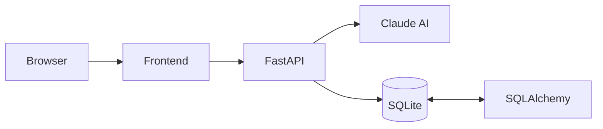

# 🦷 Toothless AI
> Intelligent AI-Powered Personal Healthcare Assistant built with **FastAPI**, **Claude AI**, **SQLAlchemy**, and **SQLite**.

> **Note:** This README was generated based on the uploaded project structure and source code review.

---

# ✨ Features

- 🤖 Claude AI powered healthcare conversations
- ❤️ Daily health check-ins
- 😊 Mood tracking
- 💊 Medication management
- 📁 Medical record organization
- ⚡ FastAPI REST backend
- 🗄️ SQLAlchemy + SQLite persistence
- 🌐 HTML/CSS/JavaScript frontend
- 📦 Modular architecture

---

# 🏗️ Architecture



# 📂 Project Structure

```text
AI_Bot_Toothless/
├── frontend/
│   ├── index.html
│   ├── style.css
│   └── app.js
├── main.py
├── toothless_ai.py
├── database.py
├── models.py
├── schemas.py
├── config.py
├── demo.py
├── requirements.txt
├── README.md
└── .gitignore
```

# 📖 Module Overview

## main.py
Entry point for the FastAPI application. Registers routes, initializes the application, validates requests and coordinates the AI and database layers.

## toothless_ai.py
Contains the Claude AI integration, prompt construction, response formatting and conversational logic.

## database.py
Creates the SQLAlchemy engine and database sessions.

## models.py
Defines ORM models representing healthcare entities stored in SQLite.

## schemas.py
Defines Pydantic request/response schemas used for validation.

## config.py
Central location for API keys and application configuration.

## demo.py
Example runner for demonstrating project functionality.

# 🚀 Installation

```bash
git clone https://github.com/psyccho00/AI_Bot_Toothless.git
cd AI_Bot_Toothless
pip install -r requirements.txt
uvicorn main:app --reload
```

# 💡 Why this project?

Toothless AI demonstrates how modern LLMs can be integrated into a structured healthcare platform using clean backend architecture, database persistence, and a lightweight frontend.

# 🛣️ Roadmap

- User authentication
- Cloud deployment
- Docker support
- PostgreSQL support
- Notification system
- Analytics dashboard

# 🤝 Contributing

Fork the repository, create a feature branch, commit your changes, and open a pull request.

# 📄 License

MIT License

# 👨‍💻 Author

**Joydeep**

Mechanical Engineering Graduate – NIT Durgapur

Aspiring AI Engineer • Data Scientist • Backend Developer

If you found this project useful, consider giving it a ⭐ on GitHub.
